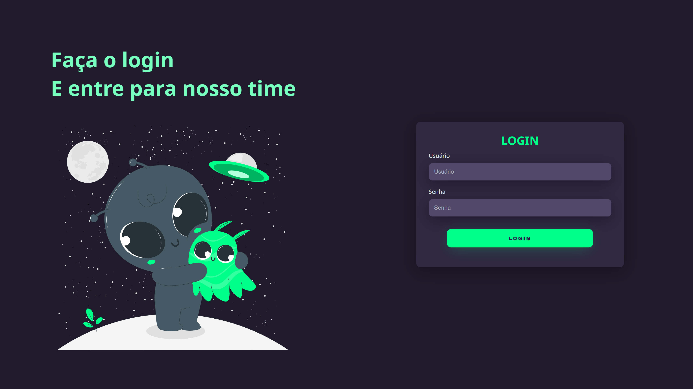

<h1 align="center"> Tela de login </h1>

Projeto de introdução ao HTML e CSS, com o intuito de praticar e estudar.

  <a href="#-tecnologias">Tecnologias</a>&nbsp;&nbsp;&nbsp;|&nbsp;&nbsp;&nbsp;
  <a href="#-projeto">Projeto</a>&nbsp;&nbsp;&nbsp;|&nbsp;&nbsp;&nbsp;
  <a href="#-layout">Layout</a>&nbsp;&nbsp;&nbsp;|&nbsp;&nbsp;&nbsp;

 

  

Projeto desenvolvido pela Rocketseat

<!-- [🔗 Clique aqui para acessar](https://master-class-tweet.vercel.app/) -->

## 🚀 Tecnologias

Esse projeto foi desenvolvido com as seguintes tecnologias:

- HTML e CSS

## 💻 Projeto

- Introdução ao HTML e CSS
- Layout Responsivo

## 💜 Contatos

[LinkedIn](https://www.linkedin.com/in/guilherme-sousa-4583951b2/)

guisg2001@hotmail.com